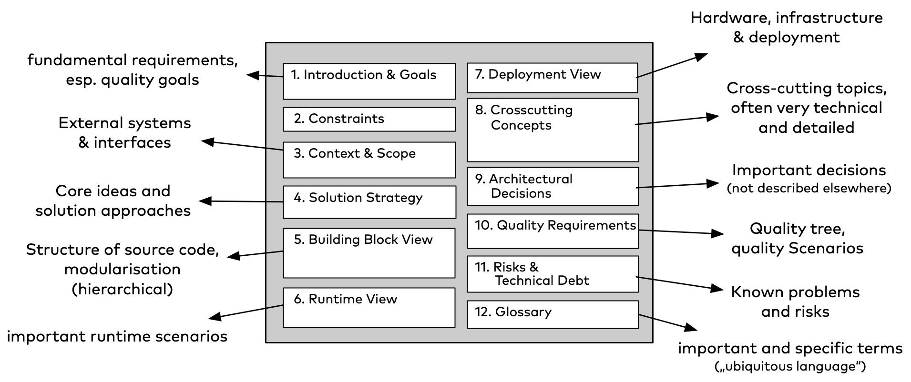

# Introduction
This documentation follows the [arc42 template](https://arc42.org/overview).

## Purpose
The "SmashGrade" app aims to provide students with the ability to visually display their current grade status throughout their entire studies. This visualization is intended to help students more easily track and understand their academic progress.

## Objective
Development of a user-friendly web application for the administration of study plans, course groups, the courses contained therein and qualification certificates/grades at the hftm.

The web application should reduce the administrative effort of the objects to be managed, increase the accuracy of the data and increase the efficiency of the processes at the hftm.

Success is measured by the use of the web application by at least 200 students and 20 lecturers who actively use the application. The accuracy of the data, the reduction in administrative effort and user satisfaction are also measured as success criteria.