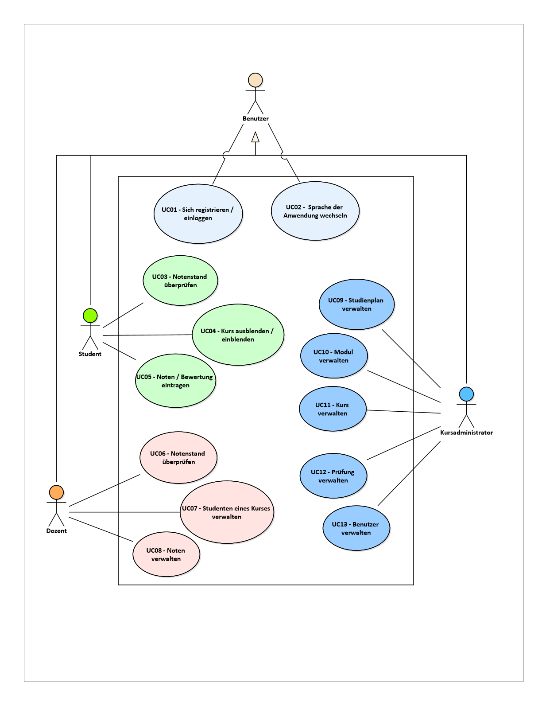

# System scope

## Business Context
SmashGrade interacts with various stakeholders within its business environment, involving direct communication with users, other IT systems, and educational institutions. These interactions are crucial for the exchange of educational content, student performance data, and administrative information.

| Use Case Nr. | Use-Case Bezeichnung                          | Aktoren            |
|--------------|-----------------------------------------------|--------------------|
| UC01         | Sich registrieren / einloggen                 | Benutzer           |
| UC02         | Sprache der Anwendung wechseln                | Benutzer           |
| UC03         | Notenstand überprüfen                         | Student            |
| UC04         | Kurs ausblenden / einblenden                  | Student            |
| UC05         | Noten / Bewertung eintragen                   | Student            |
| UC06         | Notenstand überprüfen                         | Dozent             |
| UC07         | Studenten eines Kurses verwalten              | Dozent             |
| UC08         | Noten verwalten                               | Dozent             |
| UC09         | Studienplan verwalten                         | Kursadministrator  |
| UC10         | Modul verwalten                               | Kursadministrator  |
| UC11         | Kurs verwalten                                | Kursadministrator  |
| UC12         | Prüfung verwalten                             | Kursadministrator  |
| UC13         | Benutzer verwalten                            | Kursadministrator  |
| UC17         | Notenstand aller Studenten aus Fachbereich anzeigen | Fachbereichsleiter |

## Technical Context
The technical context defines the channels and technologies that facilitate communication between SmashGrade and its users. 

| System           | Description                                                                                      | Area        |
|------------------|----------------------------|-------------|
| hftm GitHub      | A version control platform hosted by GitHub for hftm's software development projects.            | Environment |
| webUntis         | An online scheduling service used by educational institutions for managing timetables.           | Environment |
| moodle           | An open-source learning platform designed to provide educators, administrators, and learners with a single robust, secure, and integrated system to create personalized learning environments. | Environment |
| MS 365           | A suite of office productivity tools including email, document creation, and collaboration features, used by hftm for administrative and educational purposes. | Environment |
| Switch          | A service named "Switch" involved in connectivity or educational technology services, providing infrastructure or platform support. | Environment |
| MS Entra ID      | A comprehensive identity and access management service (formerly known as Azure Active Directory) for secure login and access control. | Context     |
| hftm Webserver   | Hosts hftm's web-based applications and services, serving as a central point for accessing hftm's digital resources. | Context     |
| hftm SmashGrade  | An application developed for the hftm to manage grades, courses, and evaluations, tailored to the specific needs and regulations of the hftm educational system. | Scope       |
