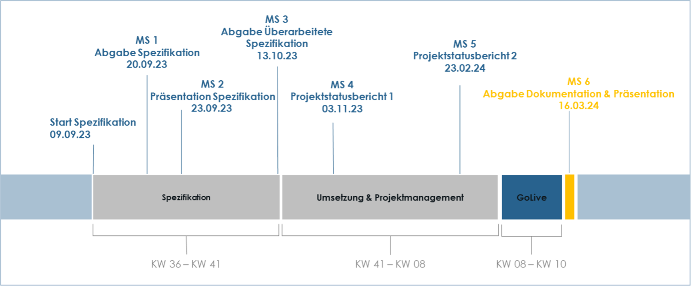

# Solution strategy
The solution strategy for the SmashGrade application is driven by a desire to integrate **innovative technologies**, apply learned **methodologies**, and leverage collective knowledge to address the educational needs of the hftm school effectively. 

Through flexible technology choices, a modular architecture, and a focus on key quality goals, alongside organizational decisions that promote agility and collaboration, we aim to deliver a scalable, secure, and user-friendly application that meets our client's requirements and exceeds their expectations.

## Technology Decisions
- **Flexible Technology Stack:** In alignment with our vision to leverage and learn from a wide range of technologies, we have not constrained ourselves to a specific set of technologies. Instead, the backend, frontend, and project management teams are empowered to select the most appropriate technologies that best address the problems at hand. This approach ensures the application remains at the forefront of technological advancements and is built using the most efficient and effective tools available.
- **Architecture Decision Records (ADR):** All technology decisions are thoroughly documented following the ADR scheme within Chapter 09 of our architectural documentation. This ensures transparency, accountability, and a clear rationale behind each chosen technology, facilitating future modifications and technology upgrades.

## Organizational Decisions
- **Specification** The specification document was part of the task. The client requested a detailed specification so that the requirements could be visualized and made more tangible. This phase can be understood as the "initialization" of the project. 
- **Adaptive Development Process:** We wanted to take an agile approach to the implementation phase so that we could learn as much as possible from each other and deal with the uncertainty regarding the choice of technology and various details. 

- **Team Organization:** Reflecting our commitment to learning and leveraging diverse expertise, we organized into specialized teams focusing on backend, frontend, and project management. This structure not only optimizes workflow efficiency but also encourages in-depth exploration and mastery of each domain.

