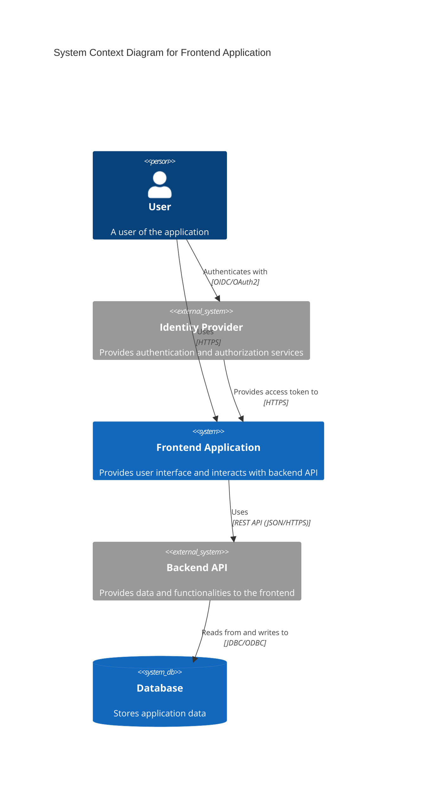

# Frontend building block view

## Overview / Structure:
This diagram describes the subsystems needed in context of a frontend application. It illustrates the actors, systems, and their relationships.

* User: Represents the individual interacting with the application.
* Identity Provider (IdP): An external system responsible for user authentication and authorization, providing access tokens to authorized users.
* Frontend Application: The web-based interface that users interact with, providing the user interface and functionalities.
* Backend API: The server-side component that provides data and functionalities to the frontend application, often accessed through REST APIs.
* Database: The system storing application data accessed and manipulated by the backend API.

