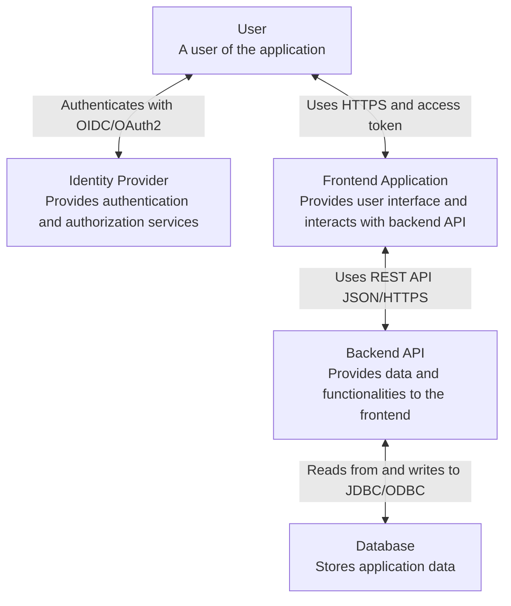
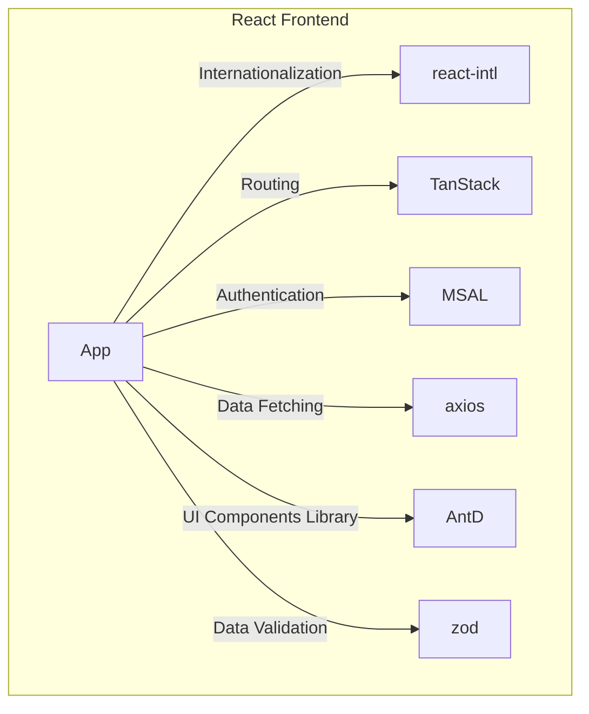

# Frontend building block view

## Overview / Structure:
This diagram describes the subsystems needed in context of a frontend application. It illustrates the actors, systems, and their relationships.

* User: Represents the individual interacting with the application.
* Identity Provider (IdP): An external system responsible for user authentication and authorization, providing access tokens to authorized users.
* Frontend Application: The web-based interface that users interact with, providing the user interface and functionalities.
* Backend API: The server-side component that provides data and functionalities to the frontend application, often accessed through REST APIs.
* Database: The system storing application data accessed and manipulated by the backend API.

## Frontend Components View
The diagram illustrates the architecture of a frontend application, highlighting its key building blocks and technologies:

* React as frontend framework
* i18 for internationalization
* TanStack Router for routing 
* Microsoft Authentication Library (MSAL) authentication module for user authentication 
* Ant Design (AntD) as a UI framework
* Axios for handling HTTP requests
* Zod for data validation

The decisions regarding the selected components are recorded in the following ADRs:

* [ADR-02 - Internationalization](../09_architectural-decisions/adr-02.md)
* [ADR-03 - Routing](../09_architectural-decisions/adr-03.md)
* [ADR-04 - Authentication](../09_architectural-decisions/adr-04.md)