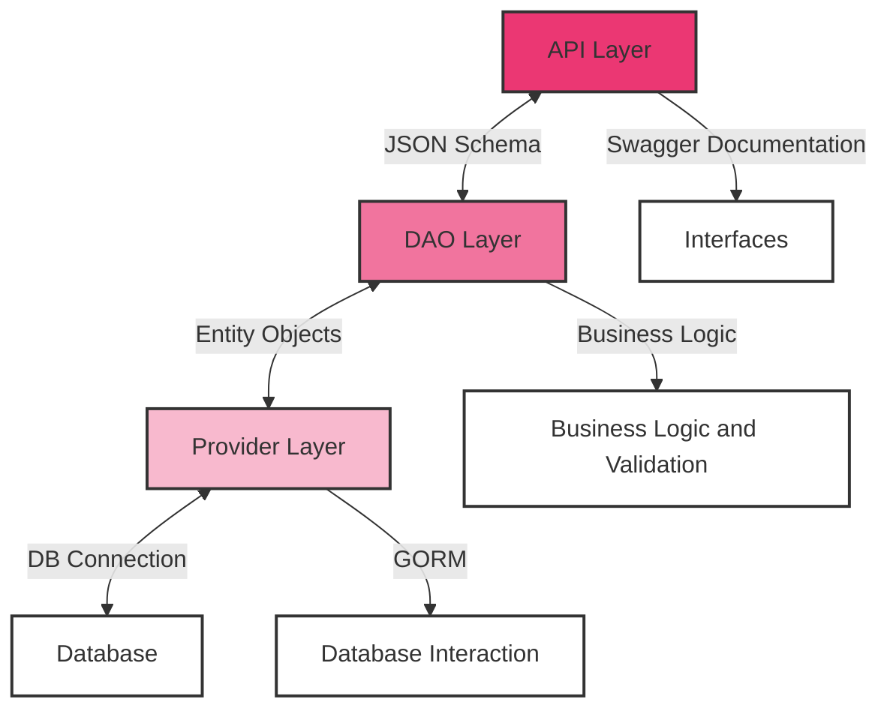

# Backend building block view

## Overview / Structure:
The backend architecture is organized into three primary layers: API, DAO, and Provider. This layered structure is designed to segregate different functionalities, facilitating easier maintenance and scalability.

## Building Block
| Building Block 	| Description                                                                                                                              	|
|----------------	|------------------------------------------------------------------------------------------------------------------------------------------	|
| API Layer      	| Handles client requests, manages API versioning, and ensures data is correctly presented for client applications.                        	| 
| DAO Layer      	| Implements the core business logic. Processes data from the API layer, applies business rules, and prepares data for the Provider layer. 	| 
| Provider Layer 	| Manages database connections and interactions using GORM, ensuring efficient data persistence and retrieval.                              |

## Interfaces
| Interface 	| Description 	|
|---	|---	|
| Client to API 	| The interface where clients interact with the application. It involves sending requests to the API layer, often through RESTful endpoints or similar protocols. This interface is crucial for user interaction, data input, and receiving responses from the application. 	|
| API to DAO 	| Transfers data using JSON Schema, ensuring consistent and valid data formatting for business logic processing. 	|
| DAO to Provider 	| Communicates using Entity Objects, providing a standardized method for handling data before database persistence. 	|
| Provider to Database 	| Utilizes GORM for database connections, abstracting the complexity of direct database operations. 	|

## Swagger
A key component of our API layer is the comprehensive documentation provided through Swagger. Swagger offers an interactive user interface, allowing developers and users to explore and test all endpoints of our API. This significantly enhances the user-friendliness and accessibility of our API.

The Swagger documentation of our API is a living document, constantly updated to reflect changes and new features in the API. Through this documentation, users can access all necessary details about endpoints, parameters, expected requests, and responses. This facilitates understanding of the API's functionality and enables efficient integration into various client applications.

For direct access to our Swagger documentation, please visit [www.smashgrade.github.io/SwaggerUI/](https://smashgrade.github.io/SwaggerUI/).

## The DAO Layer: Integrating Business Logic
In our backend architecture, the DAO (Data Access Object) Layer plays a crucial role by integrating business logic directly within it. Typically, in many architectures, the business logic and data access functionalities might be separated into distinct layers or components. However, in our design, we have chosen to combine these aspects into a single DAO layer for several reasons.

This decision was made to streamline the interaction between data processing and business rules implementation. By housing both the business logic and data access functionalities in the same layer, we achieve a efficient workflow. This approach simplifies the communication between data handling and business rule application, reducing the complexity and potential for errors that can arise from multiple layers of interaction.

Moreover, this integration allows for a more straightforward development and maintenance process. Developers can work within a single context when dealing with both data access and business rules, leading to a more unified and easily understandable codebase.

While this design choice might differ from traditional multi-layered architectures, it aligns well with our application's specific needs and goals, providing an optimal balance between simplicity, efficiency, and maintainability.

## GORM for Database Interactions

In the architecture of our backend's Provider Layer, we have incorporated GORM (Go Object-Relational Mapping library) as a key component for database interaction management. This decision aligns with our commitment to efficient and maintainable code practices.

GORM's Role in the Provider Layer:

1. Simplification of Database Operations: 
GORM abstracts the complexities of direct database interactions, enabling a more straightforward and manageable approach to data handling.
2. Automation of CRUD Operations:
By leveraging GORM's capabilities, we automate the Create, Read, Update, and Delete operations, significantly enhancing the efficiency of our database interactions.
3. Enhanced Development Productivity:
With GORM, the development process becomes more productive due to its user-friendly API, which facilitates faster and error-free coding.

The integration of GORM within the Provider Layer is a strategic choice, aimed at optimizing database operations and contributing to the overall robustness of the backend architecture.

For a detailed discussion on the reasons behind choosing GORM, including its ease of use, code efficiency, and scalability, refer to Section 8: Crosscutting Concepts [GORM](../08_crosscutting_concepts/02_concept_GORM.md).