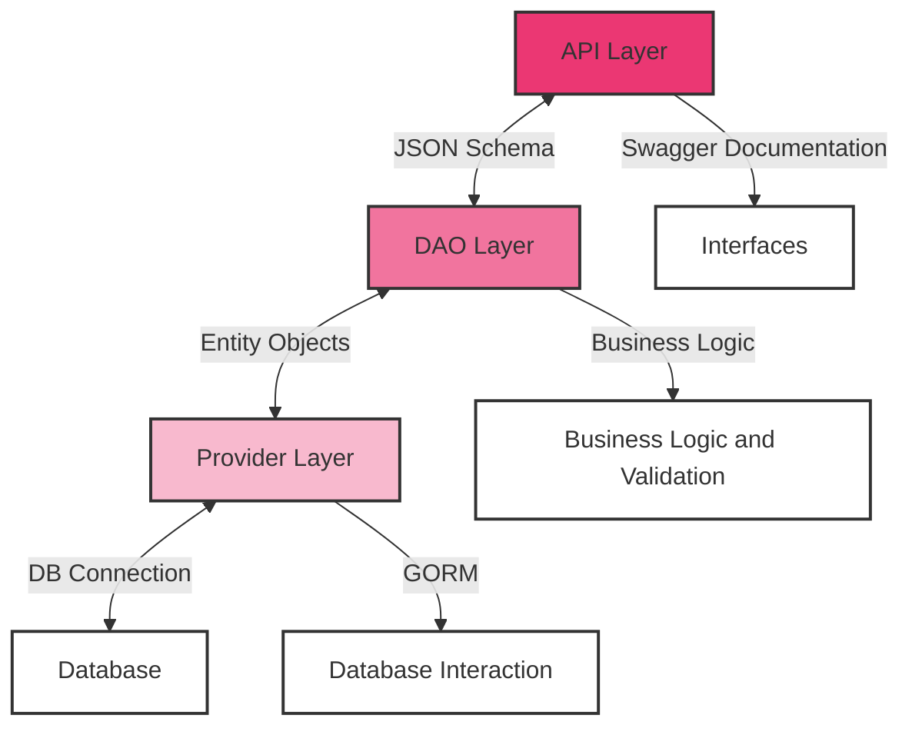

# Backend building block view

## Overview / Structure:
The backend architecture is organized into three primary layers: API, DAO, and Provider. This layered structure is designed to segregate different functionalities, facilitating easier maintenance and scalability.

## Building Block
| Building Block 	| Description                                                                                                                              	|
|----------------	|------------------------------------------------------------------------------------------------------------------------------------------	|
| API Layer      	| Handles client requests, manages API versioning, and ensures data is correctly presented for client applications.                        	| 
| DAO Layer      	| Implements the core business logic. Processes data from the API layer, applies business rules, and prepares data for the Provider layer. 	| 
| Provider Layer 	| Manages database connections and interactions using GORM, ensuring efficient data persistence and retrieval.                              |

## Interfaces
| Interface 	| Description 	|
|---	|---	|
| Client to API 	| The interface where clients interact with the application. It involves sending requests to the API layer, often through RESTful endpoints or similar protocols. This interface is crucial for user interaction, data input, and receiving responses from the application. 	|
| API to DAO 	| Transfers data using JSON Schema, ensuring consistent and valid data formatting for business logic processing. 	|
| DAO to Provider 	| Communicates using Entity Objects, providing a standardized method for handling data before database persistence. 	|
| Provider to Database 	| Utilizes GORM for database connections, abstracting the complexity of direct database operations. 	|