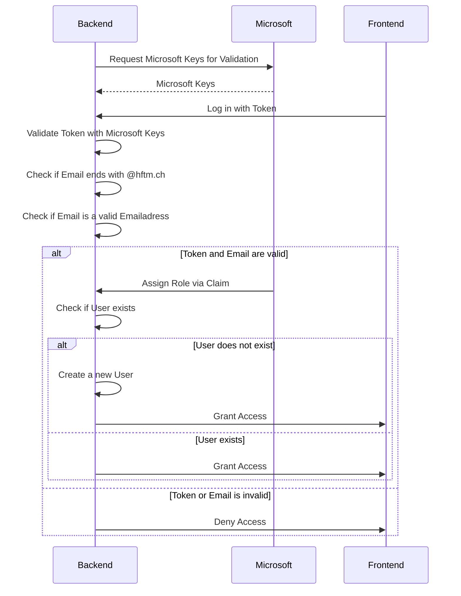

# Backend Authentification Runtime View

## Purpose and Description:
This section details the authentication process in the backend of our application, which is a critical aspect of ensuring security and proper functioning. The process involves interactions between the frontend, the backend, and external services (Microsoft Identity Provider).

## Process Flow:

- __Request for Validation Keys:__ The backend initiates the process by requesting validation keys from the Microsoft Identity Provider. These keys are essential for the verification of user tokens.
- __User Login:__ Users log in through the frontend interface, which then sends the user's authentication token to the backend.
- __Token Validation:__ The backend uses the keys obtained from Microsoft to validate the authenticity of the token.
- __Email Verification:__ Additionally, the backend checks if the user's email address ends with "@hftm.ch", ensuring that it conforms to required standards.
- __Role Assignment:__ Upon successful validation, Microsoft assigns a role to the user via claims, based on the organization's Azure setup.
- __User Existence Check:__ The backend checks if the user already exists in the system.
- __New User Creation:__ If the user does not exist, the backend proceeds to create a new user account.
- __Access Control:__ Finally, based on the outcome of the validation process, the backend grants or denies access to the user.

## Sequence Diagram

