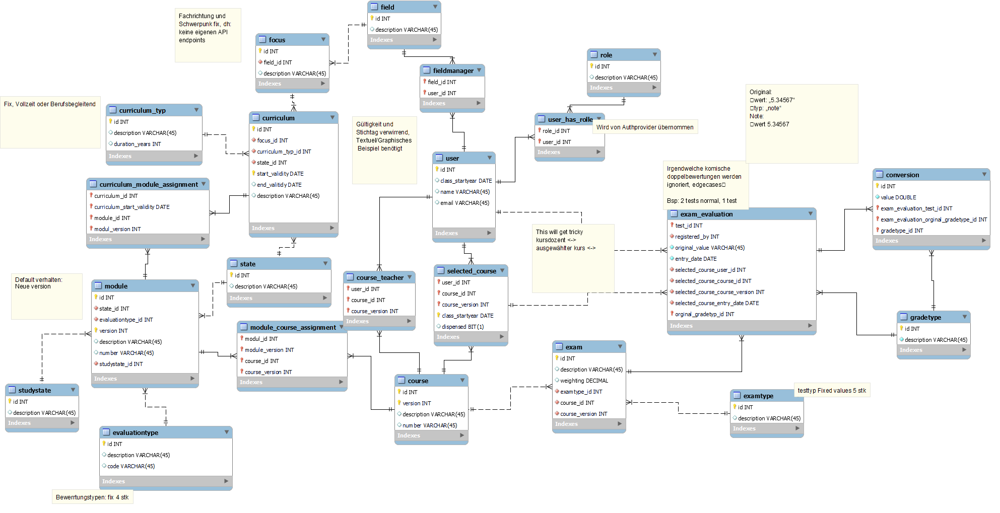

# Entity-Relationship Diagram (ERD)

The ERD for our project is a crucial component that visually outlines the database architecture specific to our system. This detailed diagram showcases the intricate relationships and entities, such as users, transactions, and other core data elements, that are fundamental to our application. It serves as a vital guide for understanding how data is organized, interconnected, and managed within our system, offering clear insights into the database's role in supporting our application's functionality.

