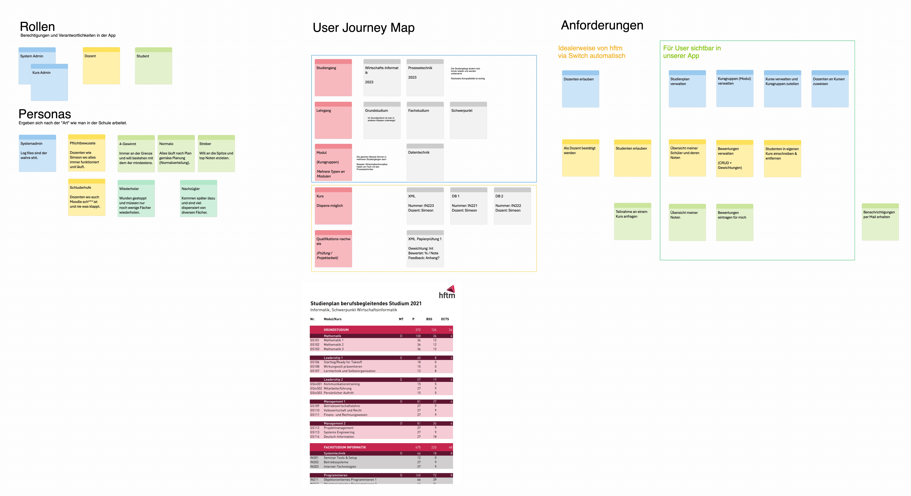
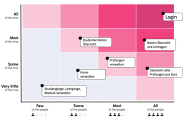
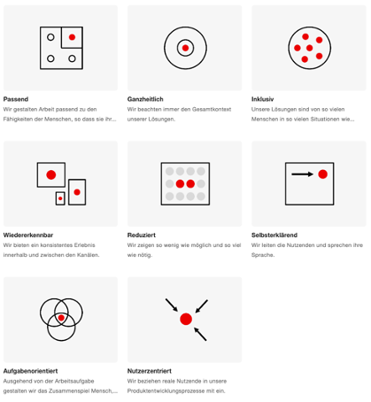

# User Experience Design 

User Experience (UX) in the context of software development refers to the process of creating products that provide meaningful and relevant experiences to users. This involves the design of the entire process of acquiring and integrating the product, including aspects of branding, design, usability, and function. UX encompasses how a user feels when interacting with a system, be it a website, a web application, mobile app, or any software application. 

The goal of UX design is to enhance customer satisfaction and loyalty by improving the usability, ease of use, and pleasure provided in the interaction between the customer and the product. UX design is an iterative process where design decisions are informed by user feedback and usability testing to refine and improve the overall experience. Key components of UX in software development include:

- **User Research:** Understanding target users, their needs, behaviors, and motivations to inform design decisions.
- **Information Architecture:** Structuring and organizing information in the software to support usability and findability.
- **Interaction Design:** Designing the interactive elements of the software to facilitate user actions and tasks.
- **Usability:** Ensuring the product is easy to use and intuitive, minimizing user frustration.
- **Visual Design:** Crafting the aesthetic aspects of the software to enhance its appeal and usability.
- **Accessibility:** Ensuring that the software can be used by people with a wide range of abilities and disabilities.

In essence, UX is about creating software products that are not only functional but also enjoyable and efficient to use, leading to positive experiences that fulfill user needs and objectives.

## User Research 
In the development of the SmashGrade App, understanding the various user groups and their interactions with the app was crucial. We employed user research techniques to juxtapose the activities of different user groups within the app. A significant tool in this process was a graphic visualization of the use cases, which provided a clear overview of how each group engages with the app.

Our research indicates that different user groups are likely to access the SmashGrade App on various devices, leading to distinct design considerations for each group:

- **Course Administrators:** Predominantly working on computers, course administrators require tabular views to quickly visualize and manage a substantial amount of content. The interface for administrators is optimized for desktop use, featuring layouts that facilitate an overview of extensive data.

- **Lecturers:** Although primarily computer users, there's a potential for lecturers to utilize the mobile app. With this in mind, content is structured modularly to support responsive design effortlessly. This approach ensures that lecturers can access and manage course information conveniently, regardless of the device.

- **Students:** As the primary user group, the student interface is designed to consolidate information across as few screens as possible. This streamlined design philosophy applies to both mobile and desktop views, ensuring that students can access necessary information and functionalities without navigating through numerous pages.

## Feature Priorization-Matrix
For the user experience (UX) design, our focus was placed on functionalities that are most frequently used by a wide range of users. The goal was to make these functions easily accessible to enhance user satisfaction and efficiency. Recognizing the importance of intuitive design, we prioritized the simplification of user interactions, ensuring that the most critical features are readily available.

## Design Principles 
In the development of the SmashGrade application, we opted to refer to the SBB (Swiss Federal Railways) Design Principles instead of starting from scratch. The decision to leverage these established principles was driven by a need for a quick, effective approach to ensure high-quality user experiences for both customers and employees without reinventing the wheel.

[Learn more: SBB Design Principles](https://digital.sbb.ch/de/principles/ux-principles/overview/)

## Information Architecture
Information architecture (IA) in the context of software development refers to the structuring and organizing of information within a digital product to help users find and interact with the data they need in an efficient and intuitive way. It's a critical component of user experience (UX) design, involving the creation of a logical hierarchy, navigation, and labeling systems to guide users through a software's interface.

For the SmashGrade application, we tailored the information architecture to accommodate the specific needs and behaviors of our three main user groups: course administrators, lecturers, and students, ensuring an optimized experience for each.

### Course Administrators
Given their need to manage large volumes of content and maintain oversight across various courses and modules, the IA for course administrators focuses on providing tabular views and comprehensive dashboards. This approach allows for quick access to information and efficient task management from a desktop environment where detailed, expansive views are more manageable and preferred.

### Lecturers 
While also primarily operating from computers, lecturers require a more flexible information architecture that supports both comprehensive desktop views and streamlined mobile access. The content is organized modularly, enabling a responsive design that adapts to different screen sizes and devices. This flexibility ensures that lecturers can access and manage course materials, grades, and student participation whether they are on-the-go or at their desks.

### Students
As the main target group, the information architecture for students is designed with a focus on simplicity and accessibility, consolidating information into a minimal number of screens. This streamlined approach suits both mobile and desktop views, ensuring students can quickly navigate through the app to find course materials, submit assignments, and view grades without unnecessary complexity or confusion.

## Wireframes 
Wireframes in UX design are simplified, schematic drawings used to layout the elements of a webpage or application interface without detailed design or content. They serve as a blueprint for the structure and organization of screens within a software project, focusing on what elements will exist on each page and how they will function. Wireframes typically depict the placement of page elements, such as navigation menus, content areas, and interactive components, allowing designers and stakeholders to conceptualize the layout and interaction patterns of an application early in the development process.

### Purpose of Wireframes in the Initialization Phase
During the initialization phase of a project, wireframes are particularly valuable because they:

- **Facilitate Communication:** Wireframes provide a visual representation of abstract ideas, making it easier for team members and stakeholders to discuss and refine concepts before significant resources are invested in development or design.
- **Clarify Features and Functionality:** By outlining where and how core functionalities will be implemented, wireframes help ensure that all project requirements are understood and accounted for from the start.
- **Enable Early Testing and Feedback:** Wireframes can be used in usability testing to gather feedback on navigation and user flows before the detailed design work begins, saving time and effort by identifying usability issues early on.

### Utility of Wireframes for Developers
For developers, wireframes are a crucial tool because they:

- **Provide a Clear Specification:** Wireframes serve as a guide for the development team on the structural layout of the application, ensuring that everyone has a clear understanding of the expected outcome.
- **Streamline Development Process:** With a clear layout and understanding of the application structure, developers can more efficiently plan and implement the user interface, reducing the likelihood of significant changes or rework later in the development process.
- **Highlight Interaction Patterns:** Wireframes can include indications of how users will interact with the interface, such as buttons, forms, and other interactive elements, helping developers understand the logic and flow that need to be programmed.

### Availability on Figma
Choosing Figma for hosting wireframes offers several advantages:

- **Collaboration:** Figma is a cloud-based design tool that facilitates real-time collaboration among UX/UI designers, developers, and stakeholders, ensuring that everyone has access to the latest versions of the wireframes.
- **Interactivity:** Figma allows for the creation of interactive wireframes, which can simulate user interactions more accurately, providing a clearer picture of how the application will work.
- **Integration:** Figma integrates with various development tools, making it easier for developers to access and utilize design specifications directly within their workflow.
