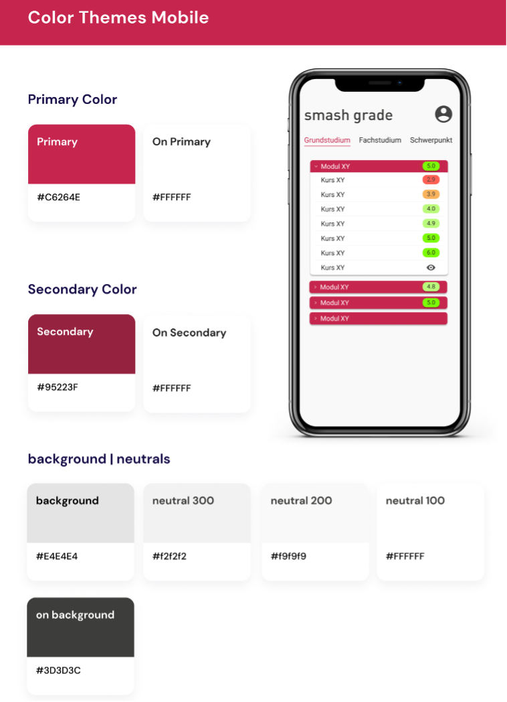
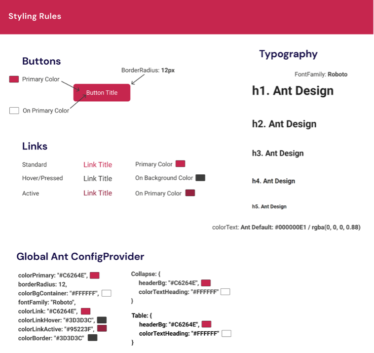

# UI Design
User Interface (UI) Design is a crucial aspect of creating digital products, focusing on the look, feel, and interactivity of the product interfaces. 

UI design involves selecting color schemes, button shapes, typography, and other visual elements, as well as the overall layout and how users interact with them.

## Corporate Design hftm
In developing the SmashGrade application, we have chosen to align closely with the established corporate design of the hftm. This strategic decision allows us to leverage the hftm's defined styling elements, including specific colors and typography, ensuring that our app not only resonates with the hftm's brand identity but also maintains consistency across all user touchpoints. By adopting these predefined design elements, we aim to create a seamless and cohesive user experience that embodies the essence of the hftm, fostering a sense of familiarity and trust among users while enhancing the app's overall aesthetic appeal.

## Design System
A Design System is a comprehensive set of guidelines, standards, and reusable components designed to ensure consistency and efficiency in the design and development of digital products across an organization.

## UI Kit 
A UI kit, short for user interface kit, is a collection of pre-designed elements that can be used to create a user interface quickly and efficiently. These elements may include buttons, forms, icons, typography, and other interface components. UI kits are often provided by design software or third-party vendors, and can be customized to fit a particular project or brand.

The main advantage of using a UI kit is speed. By using pre-designed elements, designers can save time and effort, and focus on other aspects of the design, such as layout and content. UI kits can also help maintain consistency across different pages or screens of a project, since all elements are designed to work together harmoniously.

### Styling 
In developing SmashGrade, we meticulously apply the hftm's color palette within our design system and frontend components. Our strategic use of color across the application supports a cohesive, intuitive user experience.

