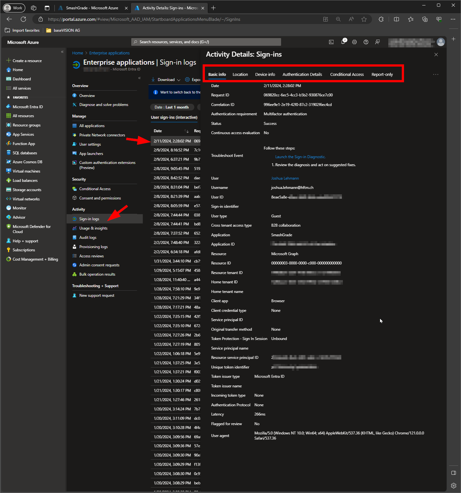

# Authentication decisions

## Status - Accepted 🟢

## Context
Which identity provider should be integrated?
In order to be able to cover the requirements and also cover topics such as the OWASP recommendations, an Entra ID integration is recommended.

## Decision
* Users can use their existing HFTM login, no additional account is required.
* Accordingly, we can also manage the application roles here in the Enterprise Application in Azure.
* With Conditional Access, OWASP recommendations such as MFA could also be implemented.

That's why we decided on Azure EntraID.

## Consequences
A details description about the setup can be found here: 
[React-MSAL-AAD](https://github.com/microsoft/Federal-App-Innovation-Community/tree/main/topics/modern-auth/React-MSAL-AAD)

## Permission Schema
The following roles are managed in the Entra Enterprise app and can be assigned to individual Entra ID users or entire groups.

We recommend a dynamic Entra ID group for Student and Dozent based on the JobTitle attribute.

| Role | Description |
| ---- | ----------- |
| Student | Graphical representation of current grade status and study progress.   The ability to enter his own grades.  |
| Dozent | Graphical representation of student grades in own courses.   View and modify student grades.|
| Kursadministrator | Creation and management of study plans.   Capture and administration of course groups, courses, and exams. |
| Fachbereichsleiter | Early identification of students with low or insufficient grades. |

## OWASP Top 10: A07 Authentication
We have made the following recommendations and considerations regarding the category: "[A07_2021-Identification_and_Authentication_Failures](https://owasp.org/Top10/A07_2021-Identification_and_Authentication_Failures/)" 

__Where possible, implement multi-factor authentication to prevent automated credential stuffing, brute force, and stolen credential reuse attacks.__
  
*The application should be included in the Conditional Access Policy, which enforces MFA. The website can only be accessed after you have successfully logged in with your HFTM account.*

__Do not ship or deploy with any default credentials, particularly for admin users.__
  
*The users are sourced entirely from Entra ID. There is therefore no default admin credentials.*

__Implement weak password checks, such as testing new or changed passwords against the top 10'000 worst passwords list.__ 
 
*This point can be intercepted directly via the Microsoft Entra Password Protection existing in the HFTM.*
 
  
*Global banned password list:*  
*The Microsoft Entra ID Protection team constantly analyzes Microsoft Entra security telemetry data looking for commonly used weak or compromised passwords*
 
 
*Custom banned password list:*  
*Some organizations want to improve security and add their own customizations on top of the global banned password list.*  
*More info: [concept-password-ban-bad](https://learn.microsoft.com/en-us/entra/identity/authentication/concept-password-ban-bad)*

__Align password length, complexity, and rotation policies with National Institute of Standards and Technology (NIST) 800-63b's guidelines in section 5.1.1 for Memorized Secrets or other modern, evidence-based password policies.__
  
*As far as we know, password rotation is not yet in use, but it could be implemented using Microsoft Entra Password Policy.*
  
*More info: [set-or-check-the-password-policies-by-using-powershell](https://learn.microsoft.com/en-us/entra/identity/authentication/concept-sspr-policy#set-or-check-the-password-policies-by-using-powershell)*

__Ensure registration, credential recovery, and API pathways are hardened against account enumeration attacks by using the same messages for all outcomes. 
Limit or increasingly delay failed login attempts, but be careful not to create a denial of service scenario. Log all failures and alert administrators when credential stuffing, brute force, or other attacks are detected.__
  
*To protect against account enumeration attacks, we would recommend activating Smart Password Lockout if this is not already implemented. Smart Lock helps to lock out bad actors who might try to guess your users passwords or use brute force methods to get in.* 
*More info: [howto-password-smart-lockout](https://learn.microsoft.com/en-us/entra/identity/authentication/howto-password-smart-lockout)*

*The login logging can be viewed directly via the Enterprise Application. Filters for interrupted or failed registrations can also be set accordingly.*

*For additional analysis and remediation of the registration, the whole thing can be rounded off with 
Microsoft Entra ID Protection which helps organizations detect, investigate, and remediate identity-based risks. 
These identity-based risks can be further fed into Conditional Access to make access decisions.
More info: [overview-identity-protection](https://learn.microsoft.com/en-us/entra/id-protection/overview-identity-protection)*

## OWASP Top 10: A09 Security Logging and Monitoring Failures 
We have made the following recommendations and considerations regarding the category: "A09:2021 – Security Logging and Monitoring Failures" 

__Ensure all login, access control, and server-side input validation failures can be logged with sufficient user context to identify suspicious or malicious accounts and held for enough time to allow delayed forensic analysis.__   
__Ensure that logs are generated in a format that log management solutions can easily consume.__
  
*The sign in logs can be viewed within 30 days in the portal.
The logs are easiliy available thorugh the Entra ID portal:*

__Ensure log data is encoded correctly to prevent injections or attacks on the logging or monitoring systems.__  
__Ensure high-value transactions have an audit trail with integrity controls to prevent tampering or deletion, such as append-only database tables or similar.__  
*The log data is managed by Microsoft Entra ID itself and is therefore not part of our application itself.*

__DevSecOps teams should establish effective monitoring and alerting such that suspicious activities are detected and responded to quickly.__  
*The Microsoft Identity Protection allows automatic remediation to be applied to suspicious actions.
[overview-identity-protection](https://learn.microsoft.com/en-us/entra/id-protection/overview-identity-protection)*

*For deeper analysis and monitoring the Sentinel built-in connector can be added to collect data from Microsoft Entra ID. The corresponding data can then be further evaluated using a KQL Query. If necessary, alerts can also be generated.* 
 
*More info:  
[signinlogs](https://learn.microsoft.com/en-us/azure/azure-monitor/reference/tables/signinlogs) 
[connect-azure-active-directory](https://learn.microsoft.com/en-us/azure/sentinel/connect-azure-active-directory)*
