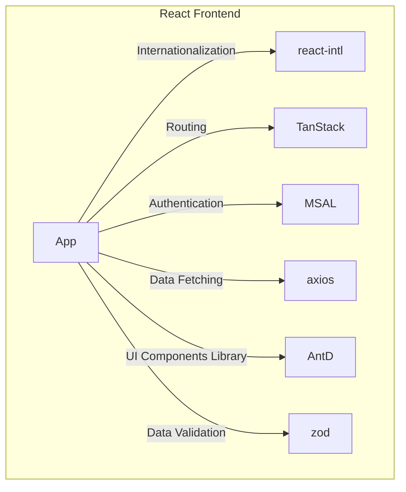

# Frontend Infrastructure Components

## Frontend Components Overview
The diagram illustrates the architecture of a frontend application, highlighting its key building blocks and technologies:
* React as frontend framework
* i18 for internationalization
* TanStack Router for routing 
* Microsoft Authentication Library (MSAL) authentication module for user authentication 
* Ant Design (AntD) as a UI framework
* Axios for handling HTTP requests
* Zod for data validation

The decisions regarding the selected components are recorded in the following ADRs:
* [ADR-02](./adr-02.md)
* [ADR-03](./adr-03.md)
* [ADR-04](./adr-04.md)